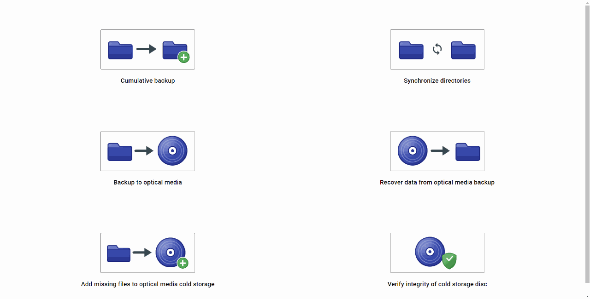
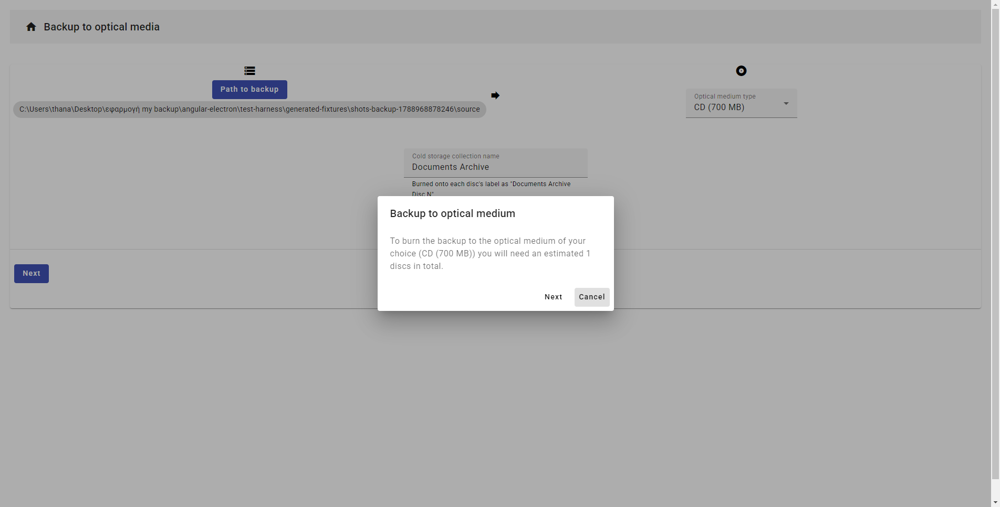
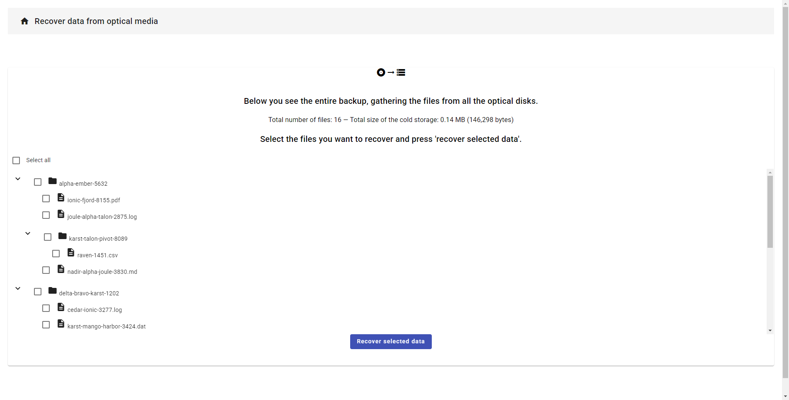
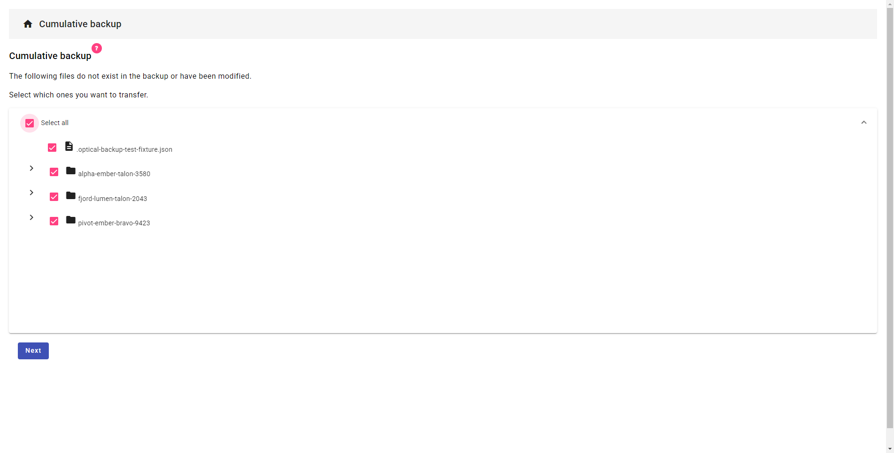
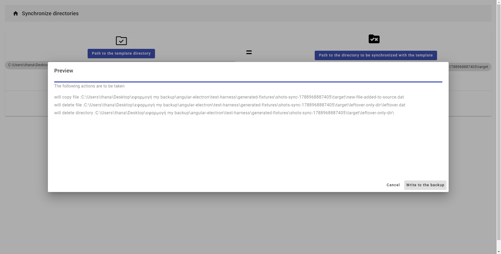
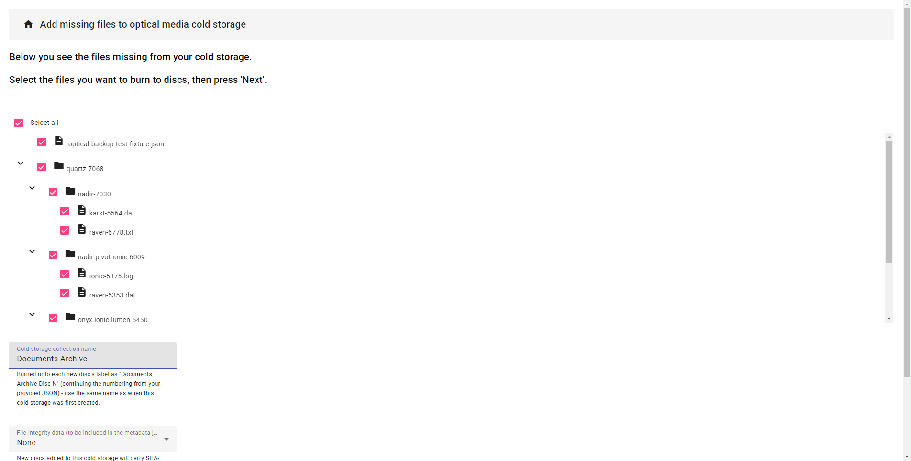
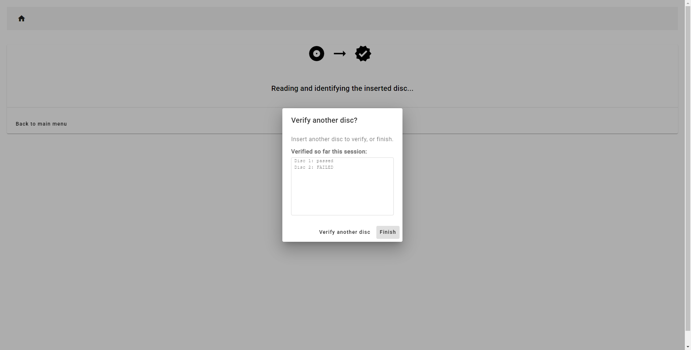

# My Backup App

This app is a set of very simple and minimal utilities for creating home backups.

I built it during a migration project to back up my own files to optical discs as cold storage and in general to manage my personal backups. It's a simple, fun little hobby project, and it's scoped to what I personally needed at the time (see the disclaimer below).

 
Recovering a backup from a JSON-provided disc listing - including reassembling a large file that was split across two discs.

## A few things about how it's built, if you're skimming this as a portfolio piece:
- Angular (renderer) + Electron (main process) + a separate worker process, talking over IPC.
- Files too large for a single disc are split via 7-Zip and reassembled on recovery, with a real bin-packing pass
  deciding what goes on which disc.
- It has an automated test harness (see [test-harness/](test-harness/) and [docs/TESTING.md](docs/TESTING.md))
  that drives the actual Electron UI end-to-end - clicking through the real wizards, with a virtual .iso disc
  standing in for a physical one - and verifies results byte-for-byte, rather than just unit-testing in isolation.
- A portable installer ([installer/](installer/)) - no registry entries, no Program Files, delete-the-folder to
  uninstall.

----------------------------------------------------------------
Please note: This application is given to you AS IS, WITHOUT ANY WARRANTY OF ANY KIND. Please be mindful when using it because there may be unknown bugs.
I am not in any way, shape, or form responsible for any loss of data due to a malfunction of this application!
This project started as a kind of exercise for me to learn the Angular framework.
This is a hobby project!
----------------------------------------------------------------

## The features of the application:
- **Incremental backup:** (Perhaps a more appropriate name would be: Cumulative backup)
This mode only adds the files not present, or re-writes the modified ones, in your current backup location.
It will not delete files that were deleted from the source location.

- **Synchronize dirs:** Adds and deletes files in order to make a 'target' directory exactly the same as the 'master' directory. Caution is needed
because this feature may also delete files from the target directory.

- **Backup to optical media:** Partitions your files to a collection of optical disks and sends them to
ImgBurn in order to be burned. It can also split large files which do not fit to a single optical disc.
By default, it also records a SHA-256 checksum for every file in the cold storage metadata json (a "File
integrity data" toggle at step 1 lets you turn this off) - defense-in-depth against a drive read error or disc
handling damage later on, independent of whatever error correction the disc/burner itself already does. See
"Verify integrity of cold storage disc" below for how these checksums actually get used.

- **Recover data from optical media:** Recovers all, or a partial selection of the contents of a backup stored in a
collection of optical media. You can now optionally provide the cold storage metadata json file (the one saved
when you first created the backup, or later updated it - see the "Add missing files" note below) so that you don't
have to insert every single disc one by one just to see what's in your cold storage. The app builds the recoverable
files list straight from the json, and will only ask you to insert the specific disc(s) that actually contain the
files you chose to recover. Important: the discs must be labeled/numbered exactly according to their order in the
json file (i.e. the disc you call "disc 1" in real life must be the first disc listed in the json), so please take
care to get that numbering right when you label your discs.

If any of the files you selected to recover turn out to be partial files (parts of a large file which didn't fit on
a single disc - see below), the app will notice once the relevant disc(s) have been copied, and will offer to
automatically reassemble the original file for you using 7-Zip. If you say no, or if the automatic reassembly fails
for some reason (e.g. a missing or corrupted part), nothing gets deleted and the app shows you the exact 7-Zip
command to reassemble the file by hand yourself later.

If the cold storage you're recovering from was backed up with SHA-256 checksums recorded (the default - see
above), the app automatically re-checks every recovered file's checksum once copying finishes, and tells you
exactly which files (if any) failed - a real, actionable sign of drive/disc trouble, not just "recovery
completed."

- **Add missing (new) files to existing optical media cold storage:** It also accounts for large files that can't fit on a single optical disc, splitting them so the large file can be distributed across multiple discs.
Has the same "File integrity data" toggle as backup-to-optical-media, for the NEW discs being added - if you load
an existing cold storage json, it pre-sets the toggle to match whatever the existing discs already do (SHA-256 or
none), so new discs stay consistent by default; you can still change it yourself.
Note that this simple app uses a rather rudimentary check (at this point) in order to recognize that a large file has been backed up in several parts. It basically uses
a naming convention (a large file e.g.: largeFile.data will be split to largeFile.data.part.001 etc.). Note that this simple assumption might cause problems in some scenarios with naming conflicts. I know, I will have to make this more robust in the future but for now, that's how it works. Sorry folks, will have to review this.

Both when you first back up to optical media, and whenever you add missing files to an existing cold storage
afterwards, the app now asks you where to save the resulting cold storage metadata json file - it used to always
get dumped into the app's internal temp folder, now you pick the folder and file name yourself via a normal save
dialog. Please keep this file somewhere safe, since it's what lets you use the "Recover data from optical media"
and "Add missing files" features without physically inserting every single disc again.

- **Verify integrity of cold storage disc:** A separate, read-only wizard for checking a cold storage disc's
SHA-256 checksums on their own, without recovering/copying anything - useful for periodically spot-checking a set
of discs you already have, independent of ever actually needing to recover from them. Point it at the cold
storage metadata json, then insert discs one at a time (in any order) - it auto-identifies each one, hashes every
file on it directly off the disc, and reports Verified/FAILED/no-integrity-data for each, with a running per-disc
tally as you go. Does nothing at all (tells you up front, before asking you to insert anything) if the json has
no checksums recorded for any file.

- On startup, the app now does a couple of housekeeping checks for you:
  - It checks whether its internal temp folder still has leftover partial (.part.NNN) files from a previous
    large-file split that never got cleaned up, and offers to clear them out for you.
  - It checks whether config.json (see "Other stuff" below) is missing the paths to 7-Zip and/or ImgBurn, or
    whether a previously configured path no longer points to an existing program (e.g. you moved or reinstalled
    it). If so, it walks you through picking the right .exe file(s) with a normal file picker and saves them back
    to config.json for you. You can still edit config.json by hand if you prefer - this is just there so you don't
    have to.
----------------------------------------------------------------
Screenshots (click any of them to view at full resolution - GitHub's inline rendering below is shrunk to fit
the page width, which can make the in-app dialog text hard to read at a glance):

 
<b>Backup to optical media</b> - the bin-packing pass tells you up front how many discs you'll need.

 
<b>Recover data from optical media</b> - the combined files tree, built straight from a JSON metadata file, no disc reads needed.

 
<b>Cumulative backup</b> - reviewing the diff before writing anything.

 
<b>Synchronize directories</b> - previewing what will be copied and deleted before committing.

 
<b>Add missing files</b> - the wizard's own diff against an existing cold storage, showing only what's actually new.

 
<b>Verify integrity of cold storage disc</b> - a running per-disc tally as a real scrolling list, so it stays readable no matter how many discs a session checks.

----------------------------------------------------------------
## Build this project:
You will need:
Angular 17.3.6
Angular CLI 17.3.6 (note Angular and the CLI must be the exact same version number)
NodeJS v18.20.5

Then use npm install to install dependencies.
You must npm install in both the ./ directory and the ./app directory.

The ./app directory contains the Electron part of the application.
The ./src/app directory contains the Angular part of the application.

The Angular Material version is 17.3.10
The Electron version is 30.0.1

To start the app in debug mode run `npm start`

----------------------------------------------------------------
Note for building the project in windows (.exe):
To build a .exe file for windows you can use the command `npm run electron:build`
This will create the release/ directory and your working .exe is in the win-unpacked directory.
Note that if you want to install the app somewhere else you will have to copy 
the entire release/ directory and use the aforementioned .exe to open the app.

There's a simple portable installer for actually installing the app somewhere - see "How to install" below.

----------------------------------------------------------------
## Testing:

This app's backup/split/recover/sync flow has an automated test harness under test-harness/ - it can click
through the real on-screen wizards for you (no physical disc needed - a .iso file is made to look like a real
inserted disc to Windows) and/or talk directly to the app's file-handling engine, then verify results
byte-for-byte. See docs/TESTING.md for the full overview (what's covered, how to run it, real bugs it has found)
and test-harness/README.md for the implementation details.

--------------------------------------------------------------
## How to install (a simple, portable installer - no admin rights, no registry entries, no Program Files):
1) Build the app first: `npm run electron:build` (see above - this produces release/win-unpacked).
2) Double-click `installer/install.bat` (or run `installer/install.ps1` directly via PowerShell).
3) Follow the prompts: pick (or create) the folder you want the app's files installed into, optionally point it
at your 7z.exe and ImgBurn.exe (you can also skip these and set them later - the app will ask again itself the
first time it actually needs one), and optionally create a shortcut (defaults to your Desktop, but you can pick
anywhere).

That's it - everything the app needs lives inside the one folder you chose, including its own temp/cache
directory. To uninstall, just delete that folder (and the shortcut, if you made one) - nothing else on your
computer was ever touched. See installer/README.md for more detail.

----------------------------------------------------------------
## Other stuff:
1) For this app to work you need to install ImgBurn in your computer. Please go to the official ImgBurn website and download the installer.
This app is essentially a utility which makes it easier to create the .ibb files which can then be used (opened) by the ImgBurn software for actually burning
your data to optical media.
We used the ImgBurn version 2.5.8.0
After installing the software, you need to point the app to the ImgBurn.exe file. The app will actually ask you for
this itself on startup if it notices config.json is missing this path (or if the path no longer points to an
existing file) - just follow the file picker dialog it shows you. If you'd rather do it by hand (or the guided
prompt isn't available for some reason), you can go to the file config.json (located in the appData/ directory)
and put the path to the ImgBurn.exe file yourself under 'imgBurnExecutablePath'. Either way, this has to be done
both for dev and the "dist" mode (dist\ directory). Note that if you
build the project using `npm run electron:build` and have already configured the config.json file, the appData\ directory
will be copied in the dist\ directory automatically, so you don't have to do anything. 

Also, note that the app will save the .ibb files for burning backups to optical media (used by ImgBurn) in the appData\ directory.
You may delete these files if you don't want or need them (these could be used to re-burn the optical disks if you wish, by just double clicking on them).
But you should not delete or modify the IBB_TEMPLATE.ibb file. This file must be included in the appData\ directory,
and it already is - it's committed in this repository, so you don't need to recreate it yourself. In case you
ever do need to regenerate it, here's how:
Go to ImgBurn and select "write files/folders to disk". Then, under the 'source' area select
'show disk layout editor'. Then add some files to your project and save the .ibb file. Then edit the file to delete the part between
[START_BACKUP_LIST] and [END_BACKUP_LIST]. (But keep these [START_BACKUP_LIST] and [END_BACKUP_LIST] tags). Then rename the file to IBB_TEMPLATE.ibb.
Also, note that before saving the .ibb from ImgBurn you may want
to check the options 'Allow more than 8 directory levels', 'Allow more than 255 characters in path' ... etc. These options are located in Advanced > Restrictions.

2) This app also makes use of the 7-zip software.
Essentially, our app calls the 7-zip using the command line in order to split large files, and (since a recent
update) to reassemble them back together again when recovering from optical media.
You will have to install the 7-zip software from the official website.
We have used version 22.01.
Just like with ImgBurn above, the app will now ask you for the path to 7z.exe itself on startup if it's missing or
no longer valid - just follow the file picker it shows you. Or, if you'd rather set it by hand, open the file
config.json (located in the appData/ directory) and add the path to the 7z.exe file under '_7zipExecutablePath'.

Note that this application only uses these 2 programs (ImgBurn and 7-Zip) through their officially provided command line interface and does not
interfere with them in any other way.

This app started from the code provided by Maxime GRIS (angular-electron starter): https://github.com/maximegris/angular-electron. Thanks.

--------------------------------------------------------------

## Take care and God bless y'all!

