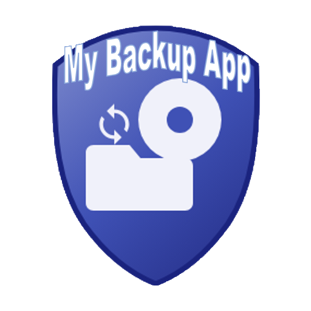
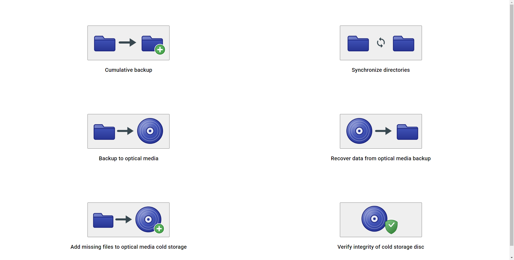

# My Backup App

<p align="center">

</p>

This app is a set of very simple and minimal utilities for creating home backups.

I built it during a migration project to back up my own files to optical discs as cold storage and in general to manage my personal backups. It's a simple, fun little hobby project, and it's scoped to what I personally needed at the time (see the disclaimer below).

<p align="center">

<br>
<sub>The main menu - all 6 features, one click away.</sub>
</p>

<p align="center">

<br>
<sub>Recovering a backup from a JSON-provided disc listing - including reassembling a large file that was split across two discs.</sub>
</p>

## A few things about how it's built, if you're skimming this as a portfolio piece

- Angular (renderer) + Electron (main process) + a separate worker process, talking over IPC.
- Files too large for a single disc are split via 7-Zip and reassembled on recovery, with a real bin-packing pass
  deciding what goes on which disc.
- Every backed-up file gets a SHA-256 checksum recorded at burn time (always on, not a toggle), re-checked again on
  recovery or on demand via a standalone verify wizard - real defense-in-depth against a drive read error or disc
  damage, not just "the copy finished."
- An automated test harness (see [test-harness/](test-harness/) and [docs/TESTING.md](docs/TESTING.md)) drives the
  real Electron UI end-to-end with [Playwright](https://playwright.dev) - clicking through the actual wizards, with
  a virtual `.iso` disc standing in for a physical one - and verifies results byte-for-byte, rather than just
  unit-testing in isolation. All 6 main-menu features have a Playwright test; `test-harness\run-all-tests.bat` runs
  the entire suite in one go with a PASS/FAIL summary.
- A portable installer ([installer/](installer/)) - no registry entries, no Program Files, delete-the-folder to
  uninstall.

---
Please note: This application is given to you AS IS, WITHOUT ANY WARRANTY OF ANY KIND. Although I have put effort in testing all the features, bugs may remain.
---
## Features

- **Incremental backup** (perhaps a more fitting name would be "Cumulative backup"): copies files that are new or
  changed into your backup location. It never deletes anything that was removed from the source. If a name is a
  file in your source but a folder in the backup (or the other way round), the backup's old one is kept, renamed
  "... (old folder)" or "... (old file)", and the new one is backed up under the name.

- **Synchronize dirs:** makes a "target" directory an exact copy of a "master" directory, adding and deleting files
  as needed - including where a name is a file on one side and a folder on the other, and where a file or folder
  was only renamed in capital letters (the target gets the master's spelling). Because it can delete files
  from the target, use it with care. When it finishes, it checks that both directories hold exactly the same files -
  by name and size in bytes - and tells you how many files there are and their total size, or lists every file that
  differs. It does not work on a whole drive (e.g. `D:\`): choose a folder on the drive instead - Windows keeps
  folders of its own at the root of a drive.

- **Backup to optical media:** splits your files across as many discs as needed and sends them to ImgBurn to burn.
  Each disc is planned to be at most 93% full for a CD, 97% for a DVD and 99% for a Blu-ray, leaving room for what
  the disc's own file system takes. Large files that don't fit on one disc are split automatically. Every file also gets a SHA-256 checksum recorded
  in the cold storage metadata JSON (always on, not optional) - protection against a later drive read error or disc
  damage. See "Verify integrity of cold storage disc" below for how these checksums get used.

  **How many files fit on one disc.** Discs are planned by the files' own sizes only, but on a disc every file also
  takes about 3 KB more - a file record, plus its data rounded up to whole 2 KB sectors - and that comes out of the
  free share above. So a full disc holds at most about this many files, which means its files must average at least
  about this size (a disc planned less full has room for more):

  | Disc | Files on one full disc, at most about | Average file size, at least about |
  |---|---|---|
  | CD (700 MB) | 16,000 | 40 KB |
  | DVD (4.7 GB) | 46,000 | 100 KB |
  | Blu-ray (25 GB) | 81,000 | 300 KB |
  | Blu-ray (50 GB) | 160,000 | 300 KB |
  | Blu-ray (100 GB) | 325,000 | 300 KB |

  These are estimates, not measured limits, and the app does not check them. Discs are filled with the largest
  files first, so the smallest files of a backup all end up together on the last disc(s) - with many small files
  (source code, e-mail, thumbnails) such a disc can have more files than this, and ImgBurn then reports that it does
  not fit. A larger disc does not help, since its free share is smaller; pack folders of many small files into an
  archive (e.g. a .zip) before backing them up instead. The same applies to "Add missing files".

- **Recover data from optical media:** recovers all, or just a selection of files, of a backup stored across your discs. You
  can optionally provide the cold storage metadata JSON file saved earlier (see "Add missing files" below) instead
  of inserting every disc just to see what's on it - the app builds the file list straight from the JSON, then only
  asks you to insert the specific disc(s) that hold what you selected. Above the list it shows how many files the
  cold storage holds and their total size, in MB and in bytes. Important: label your discs in the same
  order they appear in the JSON file (the disc you call "disc 1" must be the first one listed).

  If any recovered files are parts of a large file that was split across discs, the app offers to reassemble the
  original file with 7-Zip once every needed disc has been copied. If you decline, or reassembly fails (e.g. a
  missing or corrupted part), nothing is deleted - you get the exact 7-Zip command to do it by hand later.

  If the cold storage has SHA-256 checksums recorded, the app re-checks every recovered file once copying finishes
  and tells you exactly which ones (if any) failed - a real, actionable sign of drive or disc trouble, not just
  "recovery completed." Files recovered from an older cold storage with no recorded checksum are listed as having
  no integrity data, not as a failure. If any files do fail the check, you can choose to have just those files
  deleted.

- **Add missing (new) files to existing optical media cold storage:** adds only the files that are new since your
  last backup, onto new discs - large files that don't fit on one disc are split the same way as in "Backup to
  optical media." New discs always get SHA-256 checksums; if the existing cold storage JSON predates this feature,
  those older entries are simply listed as having no integrity data when later verified or recovered.

  Split files are recognized by a naming convention (`largeFile.data` becomes `largeFile.data.part.001`, etc.),
  which can misfire if you happen to have unrelated files matching that same pattern.

  Both "Backup to optical media" and "Add missing files" ask you where to save the resulting cold storage metadata
  JSON file, via a normal save dialog. Keep this file safe - it's what lets you use "Recover data from optical
  media" and "Add missing files" again without physically inserting every disc.

- **Verify integrity of cold storage disc:** a read-only wizard that checks a disc's SHA-256 checksums without
  recovering or copying anything - useful for periodically spot-checking discs you already have. Point it at the
  cold storage metadata JSON, then insert your discs one at a time in any order - it identifies each disc
  automatically, hashes every file on it, and reports Verified/FAILED/no-data for each, with a running tally. If
  the JSON has no checksums recorded at all, it tells you up front instead of asking you to insert anything.

- **Links, in every feature:** a link (a symbolic link or a junction) is always one single entry and is never
  followed, so nothing outside the folders you chose is ever read, copied, overwritten or deleted. Cumulative
  backup and Synchronize dirs copy a link as a link pointing to the same place. A disc cannot hold a link, so
  "Backup to optical media" and "Add missing files" burn each one as a Windows shortcut instead - one small
  `<name>.lnk` file pointing to the same place: opened from the disc it says it is broken unless that place exists,
  and recovered to where it exists, it works. (A Windows shortcut you already have is an ordinary small file, and
  every feature copies it as one.) Cumulative backup and Synchronize dirs also refuse two folders where one is
  inside the other.

- **Tested only on Windows 11, with drives formatted as NTFS.** Other versions of Windows and other file systems
  have not been tested. The app might not work on Linux (or macOS): parts of it assume Windows - its paths, and
  ImgBurn, which only runs on Windows.

- **Not supported: the FAT file system** (FAT, FAT32). Don't use the app with folders on a drive formatted as FAT -
  e.g. many USB sticks and memory cards; format such a drive as NTFS first.

- On startup, the app runs a couple of housekeeping checks:
  - It checks whether its internal temp folder has leftover partial (`.part.NNN`) files from an interrupted
    large-file split, and offers to clear them out.
  - It checks whether `config.json` (see "Other stuff" below) is missing the paths to 7-Zip and/or ImgBurn, or
    whether a configured path no longer points to a real program (e.g. it was moved or reinstalled). If so, it
    walks you through picking the right `.exe` file(s) with a file picker - each path is required, so it keeps
    asking until you provide a valid one. You can still edit `config.json` by hand instead, if you prefer.

---
Screenshots (click any of them to view at full resolution - GitHub's inline rendering below is shrunk to fit
the page width, which can make the in-app dialog text hard to read at a glance):

<p align="center">
<a href="docs/screenshots/backup-to-optical-media/02-discs-confirmation.png"></a><br>
<sub><b>Backup to optical media</b> - the bin-packing pass tells you up front how many discs you'll need.</sub>
</p>
<p align="center">
<a href="docs/screenshots/recover-data/02-file-tree.png"></a><br>
<sub><b>Recover data from optical media</b> - the combined files tree, built straight from a JSON metadata file, no disc reads needed, with the number of files and the total size of the cold storage.</sub>
</p>
<p align="center">
<a href="docs/screenshots/incremental-backup/02-diff-select-all.png"></a><br>
<sub><b>Cumulative backup</b> - reviewing the diff before writing anything.</sub>
</p>
<p align="center">
<a href="docs/screenshots/sync-dirs/03-preview.png"></a><br>
<sub><b>Synchronize directories</b> - previewing what will be copied and deleted before committing.</sub>
</p>
<p align="center">
<a href="docs/screenshots/add-missing-files/02-diff-results.png"></a><br>
<sub><b>Add missing files</b> - the wizard's own diff against an existing cold storage, showing only what's actually new.</sub>
</p>
<p align="center">
<a href="docs/screenshots/verify-integrity/01-tally.png"></a><br>
<sub><b>Verify integrity of cold storage disc</b> - a running per-disc tally as a real scrolling list, so it stays readable no matter how many discs a session checks.</sub>
</p>

---
## Build this project

You will need:
- Angular 17.3.6 and Angular CLI 17.3.6 (must be the exact same version number)
- Node.js v18.20.5

Run `npm install` in both the project root (`./`) and `./app` - the Electron part of the app lives in `./app`,
the Angular part in `./src/app`.

Angular Material is 17.3.10, Electron is 30.0.1.

Start the app in debug mode with `npm start`.

### Building a Windows .exe

Run `npm run electron:build` - it creates `release/`, with the working app under `release/win-unpacked/`. To move
the app elsewhere, copy the whole `release/win-unpacked/` folder, not just the `.exe`.

For an actual installer experience (rather than just a folder you copy by hand), see "How to install" below.

---
## Testing

This app's backup/split/recover/sync flow has an automated test harness under `test-harness/`, in two styles:

- **UI tests** (`test-harness/ui/`) drive the real, visible Electron window through
  [Playwright](https://playwright.dev) - clicking through the actual on-screen wizards exactly like a person would,
  with a virtual `.iso` file standing in for a real inserted disc (no physical disc or drive needed). This is the
  only style that can catch problems in the screens themselves - a button that doesn't do what it says, a dialog
  that never appears, a checkbox that lies about its own state - rather than just the underlying engine. All 6
  main-menu features have a Playwright UI test, including the SHA-256 integrity-checksum feature and multi-disc
  recovery with large files split across discs.
- **Worker-IPC tests** (`test-harness/worker-ipc/`) talk directly to the app's file-handling engine over the same
  IPC messages the UI sends, skipping the screens entirely - faster, and useful for testing logic like the
  bin-packing pass (which files go on which disc) in isolation.

Every test verifies its result byte-for-byte against a manifest, rather than just checking that nothing threw an
error. To run everything - every worker-IPC test, then every Playwright UI test - in one go, with a PASS/FAIL
summary at the end, just double-click `test-harness\run-all-tests.bat` (or run it from a terminal). It cleans up
scratch data before starting and after a fully-passing run, and leaves it in place for inspection if anything
fails.

To run things one at a time instead:
```
node test-harness/worker-ipc/test-partitioning.js       # fastest, safest place to start
node test-harness/ui/test-recover-single-disc.js        # a full Playwright-driven wizard, clicked through for real
node test-harness/cleanup.js --dry-run                  # see what (if anything) needs cleaning up
```

See [docs/TESTING.md](docs/TESTING.md) for the full overview (what's covered, how to run it, real bugs it has
found) and [test-harness/README.md](test-harness/README.md) for implementation details, including the Playwright
setup itself.

---
## How to install (a simple, portable installer - no admin rights, no registry entries, no Program Files)

1) Build the app first: `npm run electron:build` (see above - this produces `release/win-unpacked/`).
2) Double-click `installer/install.bat` (or run `installer/install.ps1` directly via PowerShell).
3) Follow the prompts: pick (or create) the folder to install into, optionally point it at your `7z.exe` and
   `ImgBurn.exe` (or skip this here and set them the next time you start the app, which will walk you through it
   and require a real path before you can continue), and optionally create a shortcut (defaults to your Desktop,
   but you can pick anywhere).

That's it - everything the app needs lives inside the one folder you chose, including its own temp/cache
directory. To uninstall, just delete that folder (and the shortcut, if you made one) - nothing else on your
computer is ever touched. See [installer/README.md](installer/README.md) for more detail.

---
## Other stuff

### 1. ImgBurn

Install [ImgBurn](https://www.imgburn.com/) (we used version 2.5.8.0) - this app generates the `.ibb` project
files that ImgBurn then actually burns to disc.

Point the app at your `ImgBurn.exe`: it asks you for this itself on startup if the path is missing or no longer
valid, via a normal file picker. You can also set it by hand, by editing `config.json` (in `appData/`) and setting
`imgBurnExecutablePath`. This applies both in dev and in a packaged build - `npm run electron:build` copies
`appData/` into `release/win-unpacked/resources/appData/` automatically, so an already-configured `config.json`
carries over.

The app saves the `.ibb` files it generates into `appData/`. You can delete these if you don't need them (they can
also be used to re-burn a disc later, just by double-clicking one) - but don't delete or modify
`IBB_TEMPLATE.ibb`, which is required and already committed in this repository.

If you ever need to regenerate `IBB_TEMPLATE.ibb`: in ImgBurn, choose "Write files/folders to disc", open "Show
disk layout editor" under Source, add some files, and save the `.ibb`. Then edit the saved file to delete
everything between `[START_BACKUP_LIST]` and `[END_BACKUP_LIST]` (keep the tags themselves), and rename it to
`IBB_TEMPLATE.ibb`. Before saving from ImgBurn, also enable "Allow more than 8 directory levels" and "Allow more
than 255 characters in path", under Advanced > Restrictions.

### 2. 7-Zip

Install [7-Zip](https://www.7-zip.org/) (we used version 22.01) - the app calls it via the command line to split
large files, and to reassemble them again during recovery.

Same as ImgBurn: the app asks for `7z.exe`'s path on startup if it's missing or no longer valid, or you can set it
by hand in `config.json` under `_7zipExecutablePath`.

The app only ever calls ImgBurn and 7-Zip through their official command-line interfaces - it doesn't interfere
with either program in any other way.

---
This app started from the code provided by Maxime GRIS (angular-electron starter): https://github.com/maximegris/angular-electron. Thanks.

---

## Take care and God bless y'all!
